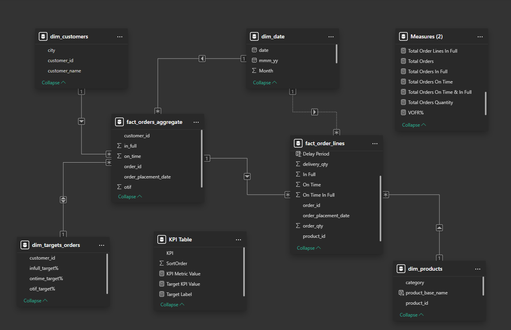

# Suply Chain Analysis in FMCG

Live Dashboard [Link](https://app.powerbi.com/view?r=eyJrIjoiODUxZTZjYmUtYzZjMS00NjIyLWI2ZDktYzJkNmIyNWYwODMyIiwidCI6ImM4Mzc1Y2MyLTBjYzEtNGQ2OC04MTIwLTM1ODkxZmFkNjNkOCIsImMiOjEwfQ%3D%3D)

## Problem Statement  
AtliQ Mart is a growing FMCG manufacturer headquartered in Gujarat, India. It is currently operational in three cities Surat, Ahmedabad and Vadodara. They want to expand to other metros/Tier 1 cities in the next 2 years.

AtliQ Mart is currently facing a problem where a few key customers did not extend their annual contracts due to service issues. It is speculated that some of the essential products were either not delivered on time or not delivered in full over a continued period, which could have resulted in bad customer service. Management wants to fix this issue before expanding to other cities and requested their supply chain analytics team to track the ’On time’ and ‘In Full’ delivery service level for all the customers daily basis so that they can respond swiftly to these issues.

The Supply Chain team decided to use a standard approach to measure the service level in which they will measure ‘On-time delivery (OT) %’, ‘In-full delivery (IF) %’, and OnTime in full (OTIF) %’ of the customer orders daily basis against the target service level set for each customer.

### Task:  
Peter Pandey is the data analyst in the supply chain team who joined AtliQ Mart recently. He has been briefed about the the task in the stakeholder business review meeting. Now imagine yourself as Peter Pandey and play the role of the new data analyst who is excited to build this dashboard and perform the following task:

- Create the metrics according to the metrics list.
- Create a dashboard according to the requirements provided by stakeholders in the business review meeting. You will be provided with the transcript of this business review meeting in comic form.
- Create relevant insights not provided in the metric list/stakeholder meeting.

## Data Model  

## Insight

- All key delivery metrics (OT%, IF%, OTIF%) are significantly below targets.

- On average, only 29% of orders are delivered both on time and in full (OTIF).

- No noticeable improvements in metrics over the past months – performance remains stagnant.

- Surat has the best city performance but still underperforms vs. target.

- Propel Mart and Atlas Stores perform better than others but still fall short on OTIF.

- Lotus Mart and Acclaimed Stores have the most delayed deliveries – also among the top order receivers.

- Is this due to inaccurate delivery date estimates or capacity overload?

- Among the product lines, AM Butter 250 has the lowest LIFR (63.52%), indicating underperformance compared to the average. Other products are around the system average and do not show significant deviation.

- Warehousing and dispatch processes (VOFR) are excellent – root cause likely lies in production or planning.

- There is a huge gap in IF% for most of the customers. Is it because of less production?
